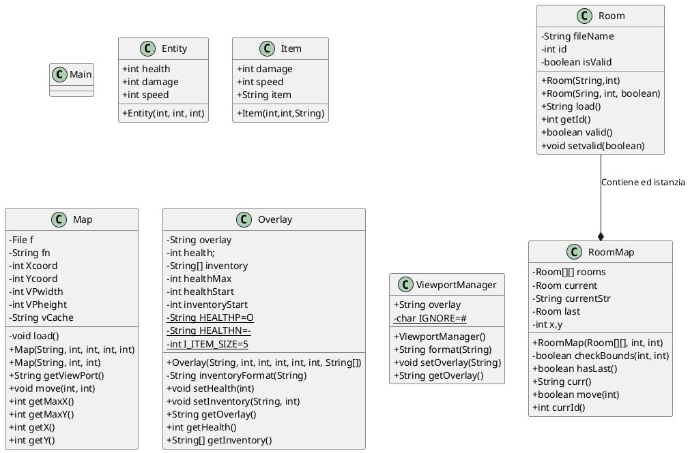

# Class Diagram

```plantuml
@startuml
skinparam classAttributeIconSize 0

class Main {

}

class Entity {
    + int health
    + int damage
    + int speed
    + Entity(int, int, int)
}

class Item {
    + int damage
    + int speed
    + String item
    + Item(int,int,String)
}

class Map {
    - File f
    - String fn
    - int Xcoord
    - int Ycoord
    - int VPwidth
    - int VPheight
    - String vCache
    - void load()
    + Map(String, int, int, int, int)
    + Map(String, int, int)
    + String getViewPort()
    + void move(int, int)
    + int getMaxX()
    + int getMaxY()
    + int getX()
    + int getY()
}

class Overlay {
    - String overlay
    - int health;
    - String[] inventory
    - int healthMax
    - int healthStart
    - int inventoryStart
    - {static} String HEALTHP=O
    - {static} String HEALTHN=-
    - {static} int I_ITEM_SIZE=5
    + Overlay(String, int, int, int, int, int, String[])
    - String inventoryFormat(String)
    + void setHealth(int)
    + void setInventory(String, int)
    + String getOverlay()
    + int getHealth()
    + String[] getInventory()
}

class Room {
    - String fileName
    - int id
    - boolean isValid
    + Room(String,int)
    + Room(Sring, int, boolean)
    + String load()
    + int getId()
    + boolean valid()
    + void setvalid(boolean)
}

class RoomMap {
    - Room[][] rooms
    - Room current
    - String currentStr
    - Room last
    - int x,y
    + RoomMap(Room[][], int, int)
    - boolean checkBounds(int, int)
    + boolean hasLast()
    + String curr()
    + boolean move(int)
    + int currId()
}

class ViewportManager {
    + String overlay
    - {static} char IGNORE=#
    + ViewportManager()
    + String format(String)
    + void setOverlay(String)
    + String getOverlay()
}

Room  -down-*  RoomMap : Contiene ed istanzia

@enduml

```
