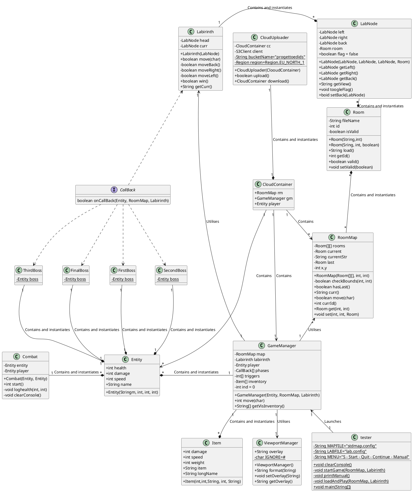

# Class diagram

```plantuml
@startuml
skinparam classAttributeIconSize 0

class Entity {
    + int health
    + int damage
    + int speed
    + String name
    + Entity(Stringm, int, int, int)
}

class Item {
    + int damage
    + int speed
    + int weight
    + String item
    + String longName
    + Item(int,int,String, int, String)
}

interface CallBack{
    boolean onCallBack(Entity, RoomMap, Labirinth)
}

class Combat {
    - Entity entity
    - Entity player
    + Combat(Entity, Entity)
    + int start()
    - void loghealth(int, int)
    - void clearConsole()
}

class FinalBoss {
    - {Static} Entity boss
}

class FirstBoss {
    - {static} Entity boss
}

class SecondBoss {
    - {static} Entity boss
}

class ThirdBoss {
    - {static} Entity boss
}

class LabNode {
    - LabNode left
    - LabNode right
    - LabNode back
    - Room room
    + boolean flag = false
    + LabNode(LabNode, LabNode, LabNode, Room)
    + LabNode getLeft()
    + LabNode getRight()
    + LabNode getBack()
    + String getView()
    + void toogleFlag()
    + boid setBack(LabNode)
}

class Labirinth {
    - LabNode head
    - LabNode curr
    + Labirinth(LabNode)
    + boolean move(char)
    - boolean moveBack()
    - boolean moveRight()
    - boolean moveLeft()
    + boolean win()
    + String getCurr()
}

class CloudContainer {
    + RoomMap rm
    + GameManager gm
    + Entity player
}

class CloudUploader {
    - CloudContainer cc
    - S3Client client
    - {static} String bucketName="progettoedids"
    - {static} Region region=Region.EU_NORTH_1
    + CloudUploader(ClooudContainer)
    + boolean upload()
    + CloudContainer download()
}

class GameManager {
    - RoomMap map
    - Labirinth labirinth
    - Entity player
    - CallBack[] phases
    - int[] triggers
    - Item[] inventory
    - int ind = 0
    + GameManager(Entity, RoomMap, Labirinth)
    + int move(char)
    + String[] getVisInventory()
}

class Room {
    - String fileName
    - int id
    - boolean isValid
    + Room(String,int)
    + Room(Sring, int, boolean)
    + String load()
    + int getId()
    + boolean valid()
    + void setValid(boolean)
}

class RoomMap {
    - Room[][] rooms
    - Room current
    - String currentStr
    - Room last
    - int x,y
    + RoomMap(Room[][], int, int)
    - boolean checkBounds(int, int)
    + boolean hasLast()
    + String curr()
    + boolean move(char)
    + int currId()
    + Room get(int, int)
    + void set(int, int, Room)
}

class ViewportManager {
    + String overlay
    - {static} char IGNORE=#
    + ViewportManager()
    + String format(String)
    + void setOverlay(String)
    + String getOverlay()
}

class tester{
    - {static} String MAPFILE="stdmap.config"
    - {static} String LABFILE="lab.config"
    - {static} String MENU="S - Start - Quit - Continue - Manual"
    + {static} void clearConsole()
    - {static} void startGame(RoomMap, Labirinth)
    - {static} void printManual()
    - {static} void loadAndPlay(RoomMap, Labirinth)
    + {static} void main(String[])
}

RoomMap "*" -left-* "*"  Room : Contains and instantiates
Combat "1" -right-* "*" Entity : Contains and instantiates
GameManager "1" --* "*" Item : Contains and instantiates
LabNode "*" -right-* "*" Room : Contains and instantiates
Labirinth "1" -right-* "*" LabNode : Contains and instantiates
GameManager "1" -up-> "*" RoomMap : Utilises
GameManager "1" -left-* "*" Entity : Contains and instantiates
GameManager "1" --> "1" Labirinth : Utilises
GameManager "1" -down-> "1" ViewportManager : Utilises
tester "1" -up-> "1" GameManager : Launches
FirstBoss "1" --* "1" Entity : Contains and instantiates
SecondBoss "1" --* "1" Entity : Contains and instantiates
ThirdBoss "1" --* "1" Entity : Contains and instantiates
FinalBoss "1" --* "1" Entity : Contains and instantiates
CloudUploader "1" --* "1" CloudContainer : Contains and instantiates
CloudContainer "1" --> "*" RoomMap : Contains
CloudContainer "1" --> "*" Entity : Contains
CloudContainer "1" --> "1" GameManager : Contains
CallBack .down.> FinalBoss
CallBack .down.> FirstBoss
CallBack .down.> SecondBoss
CallBack .down.> ThirdBoss
CallBack .up.> Labirinth

@enduml
```
