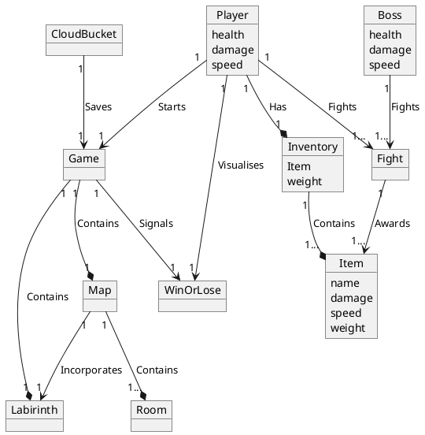

# Domain model

```plantuml
@startuml
object Player {
    health
    damage
    speed
}
object Boss {
    health
    damage
    speed
}
object Inventory {
    Item
    weight
}
Object Item {
    name
    damage
    speed
    weight
}
Object Labirinth 
Object Game
Object Map
Object Room
Object CloudBucket
Object Fight
Object WinOrLose

Game "1" --* "1" Labirinth : Contains
Game "1" --* "1" Map : Contains
Map "1" --* "1..." Room : Contains
Map "1" --> "1" Labirinth : Incorporates
Inventory "1" --* "1..." Item : Contains
Player "1" --> "1..." Fight : Fights
Boss "1" --> "1..." Fight : Fights
Player "1" --* "1" Inventory : Has
Fight "1" --> "1..." Item : Awards
Player "1" --> "1" Game : Starts
Game "1" --> "1" WinOrLose : Signals
Player "1" --> "1" WinOrLose : Visualises
CloudBucket "1" --> "1" Game : Saves
@enduml
```
