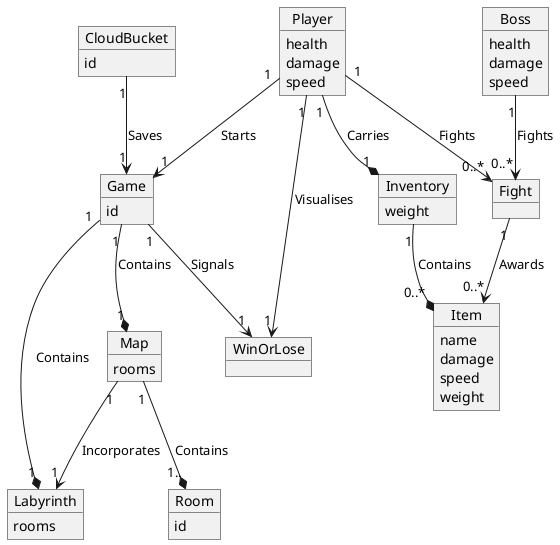

# Domain model

```plantuml
@startuml
object Player {
    health
    damage
    speed
}
object Boss {
    health
    damage
    speed
}
object Inventory {
    weight
}
object Item {
    name
    damage
    speed
    weight
}
object Labyrinth {
    rooms
}
object Game {
    id
}
object Map {
    rooms
}
object Room {
    id
}
object CloudBucket {
    id
}
object Fight
object WinOrLose

Game "1" --* "1" Labyrinth : Contains
Game "1" --* "1" Map : Contains
Map "1" --* "1.." Room : Contains
Map "1" --> "1" Labyrinth : Incorporates
Inventory "1" --* "0..*" Item : Contains
Player "1" --> "0..*" Fight : Fights
Boss "1" --> "0..*" Fight : Fights
Player "1" --* "1" Inventory : Carries
Fight "1" --> "0..*" Item : Awards
Player "1" --> "1" Game : Starts
Game "1" --> "1" WinOrLose : Signals
Player "1" --> "1" WinOrLose : Visualises
CloudBucket "1" --> "1" Game : Saves
@enduml
```
