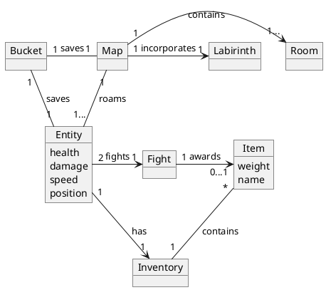

# Domain model

```plantuml
@startuml
object Entity{
health
damage
speed
position
}
object Fight
object Item{
weight
name
}
object Bucket
object Map
object Room
object Labirinth
object Inventory
Entity "1"-left>"1" Inventory: has
Inventory "1"-up-"*" Item : contains
Map "1"->"1..." Room : contains
Fight"1"->"0...1" Item: awards
Entity "2"->"1" Fight: fights
Entity "1..."-up-"1" Map: roams
Bucket "1"-"1" Map: saves
Bucket "1"-"1" Entity: saves
Map "1"->"1" Labirinth: incorporates
@enduml
```
