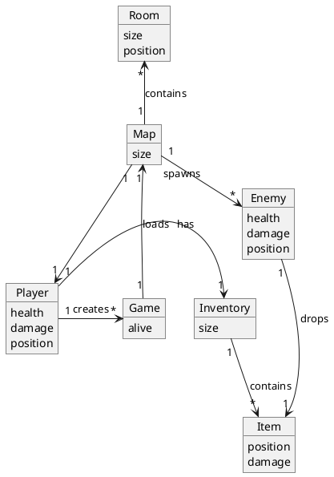

# Domain model

```plantuml
@startuml
object Player{
health
damage
position
}
object Enemy{
health
damage
position
}
object Map{
size
}
object Room{
size
position
}
object Item{
position
damage
}
object Game{
alive
}
object Inventory{
size
}
Player "1" -> "1" Inventory : has
Player "1" -> "*" Game: creates
Inventory "1"-down->"*" Item: contains
Map "1"-down-> "1" Player
Game "1" -> "1" Map: loads
Map "1"-up->"*" Room: contains
Map "1" -> "*" Enemy: spawns
Enemy "1" -> "1" Item: drops
@enduml
```
