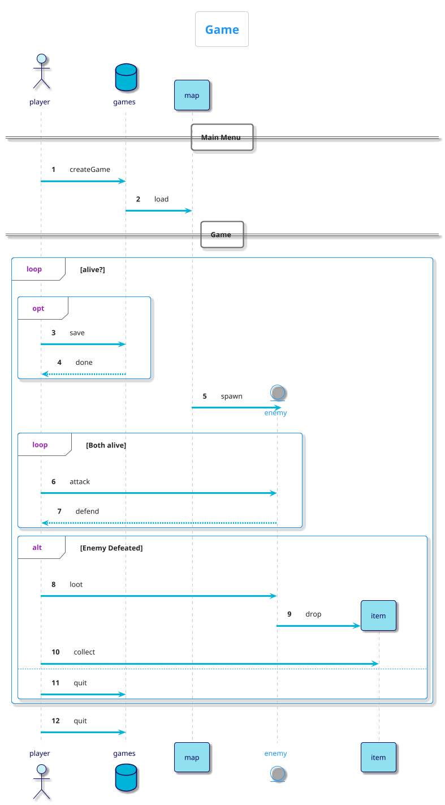
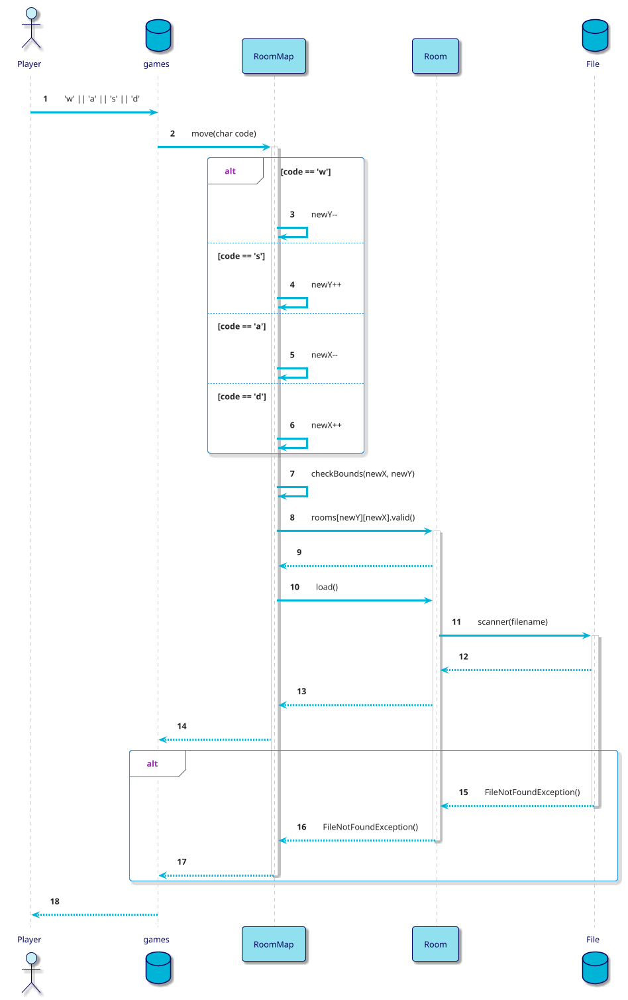
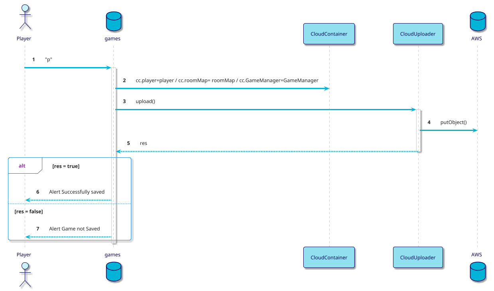
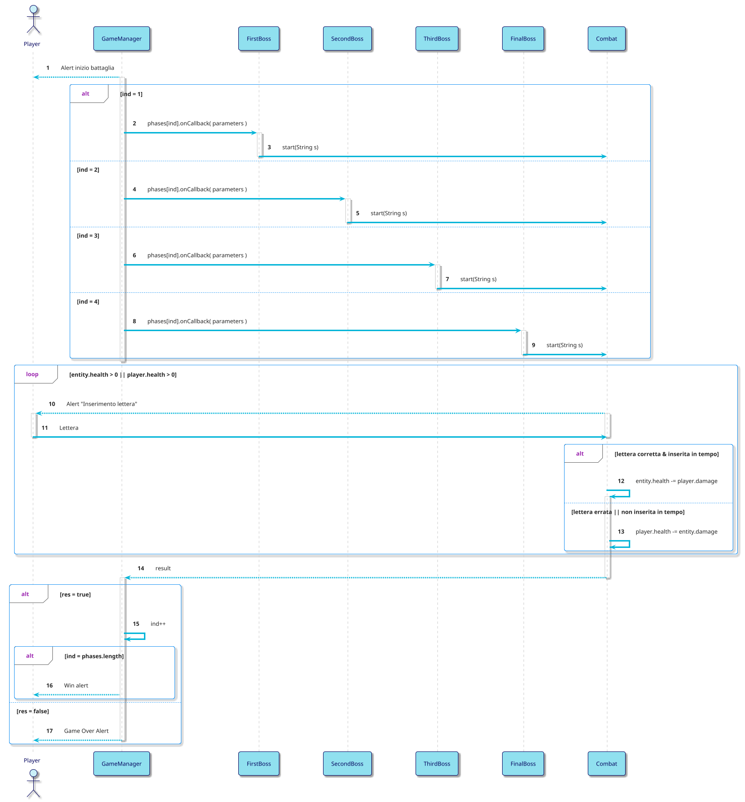

# System Sequence Diagrams

```plantuml
@startuml
!theme materia-outline
autonumber 

skinparam ArrowColor #00B4D8
skinparam ActorBorderColor #03045E
skinparam ActorFontColor #03045E
skinparam ActorBackgroundColor #CAF0F8
skinparam ParticipantFontColor #03045E
skinparam ParticipantBorderColor #03045E
skinparam ParticipantBackgroundColor #90E0EF
skinparam DatabaseBorderColor #03045E
skinparam DatabaseBackgroundColor #00B4D8
skinparam DatabaseFontColor #03045E
skinparam BackgroundColor #FFFFFF

title Game

actor player
database games
participant map

== Main Menu ==
player->games: createGame
games->map: load
== Game ==
loop alive?
opt
player->games: save
games-->player: done
end
create entity enemy
map->enemy: spawn
loop Both alive
player->enemy: attack
enemy-->player: defend
end
alt Enemy Defeated
player->enemy: loot
create participant item
enemy->item: drop
player->item: collect
else
player->games: quit
end
end
player->games: quit
@enduml

```

# Internal Sequence Diagrams

## move(char code)

```plantuml
@startuml
!theme materia-outline
autonumber
skinparam ArrowColor #00B4D8
skinparam ActorBorderColor #03045E
skinparam ActorFontColor #03045E
skinparam ActorBackgroundColor #CAF0F8
skinparam ParticipantFontColor #03045E
skinparam ParticipantBorderColor #03045E
skinparam ParticipantBackgroundColor #90E0EF
skinparam DatabaseBorderColor #03045E
skinparam DatabaseBackgroundColor #00B4D8
skinparam DatabaseFontColor #03045E
skinparam BackgroundColor #FFFFFF

actor Player
database games
participant RoomMap
participant Room
database File


Player -> games : 'w' || 'a' || 's' || 'd'
games -> RoomMap : move(char code)
activate RoomMap


alt code == 'w'
RoomMap -> RoomMap : newY--

else code == 's'
RoomMap -> RoomMap : newY++

else code == 'a'
RoomMap -> RoomMap : newX--

else code == 'd'
RoomMap -> RoomMap : newX++

end

RoomMap -> RoomMap : checkBounds(newX, newY)
RoomMap -> Room : rooms[newY][newX].valid()
activate Room
Room --> RoomMap : 
RoomMap -> Room : load()

Room -> File : scanner(filename)
activate File
File --> Room
Room --> RoomMap
RoomMap --> games
alt 
File --> Room : FileNotFoundException()
deactivate File
Room --> RoomMap : FileNotFoundException()
deactivate Room
RoomMap --> games
deactivate RoomMap
end

games --> Player
deactivate Room
deactivate RoomMap

@enduml


```

## Save game

```plantuml
@startuml
!theme materia-outline
autonumber
skinparam ArrowColor #00B4D8
skinparam ActorBorderColor #03045E
skinparam ActorFontColor #03045E
skinparam ActorBackgroundColor #CAF0F8
skinparam ParticipantFontColor #03045E
skinparam ParticipantBorderColor #03045E
skinparam ParticipantBackgroundColor #90E0EF
skinparam DatabaseBorderColor #03045E
skinparam DatabaseBackgroundColor #00B4D8
skinparam DatabaseFontColor #03045E
skinparam BackgroundColor #FFFFFF

actor Player
database games
participant CloudContainer
participant CloudUploader
database AWS

Player -> games : "p"

activate games

games -> CloudContainer : cc.player=player / cc.roomMap= roomMap / cc.GameManager=GameManager
games -> CloudUploader : upload()
activate CloudUploader
CloudUploader -> AWS : putObject()

CloudUploader --> games : res

deactivate CloudUploader

alt res = true
games --> Player : Alert Successfully saved

else res = false
games --> Player : Alert Game not Saved
end
deactivate games


@enduml
```

## Battaglia con i boss

```plantuml
@startuml
!theme materia-outline
autonumber
skinparam ArrowColor #00B4D8
skinparam ActorBorderColor #03045E
skinparam ActorFontColor #03045E
skinparam ActorBackgroundColor #CAF0F8
skinparam ParticipantFontColor #03045E
skinparam ParticipantBorderColor #03045E
skinparam ParticipantBackgroundColor #90E0EF
skinparam DatabaseBorderColor #03045E
skinparam DatabaseBackgroundColor #00B4D8
skinparam DatabaseFontColor #03045E
skinparam BackgroundColor #FFFFFF

actor Player
participant GameManager
participant FirstBoss
participant SecondBoss
participant ThirdBoss
participant FinalBoss
participant Combat


GameManager --> Player : Alert inizio battaglia
activate GameManager

alt ind = 1
GameManager -> FirstBoss : phases[ind].onCallback( parameters )
activate FirstBoss
FirstBoss -> Combat : start(String s)
deactivate FirstBoss
else ind = 2
GameManager -> SecondBoss : phases[ind].onCallback( parameters )
activate SecondBoss
SecondBoss -> Combat :start(String s)
deactivate SecondBoss
else ind = 3 
GameManager -> ThirdBoss : phases[ind].onCallback( parameters )
activate ThirdBoss
ThirdBoss -> Combat : start(String s)
deactivate ThirdBoss
else ind = 4
GameManager -> FinalBoss: phases[ind].onCallback( parameters )
activate FinalBoss
FinalBoss -> Combat :start(String s)
deactivate FinalBoss
end

deactivate GameManager

loop entity.health > 0 || player.health > 0

Combat --> Player : Alert "Inserimento lettera"
activate Combat
activate Player

Player -> Combat : Lettera

deactivate Combat
deactivate Player


alt lettera corretta & inserita in tempo
Combat -> Combat : entity.health -= player.damage
activate Combat
else lettera errata || non inserita in tempo

Combat -> Combat : player.health -= entity.damage
end

end


Combat --> GameManager : result
deactivate Combat
alt res = true
activate GameManager
GameManager -> GameManager : ind++

  alt ind = phases.length
  GameManager --> Player : Win alert

  end
else res = false
GameManager --> Player : Game Over Alert

deactivate GameManager
end

@enduml
```
