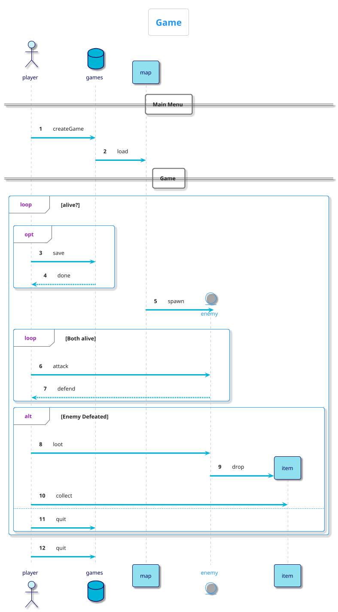
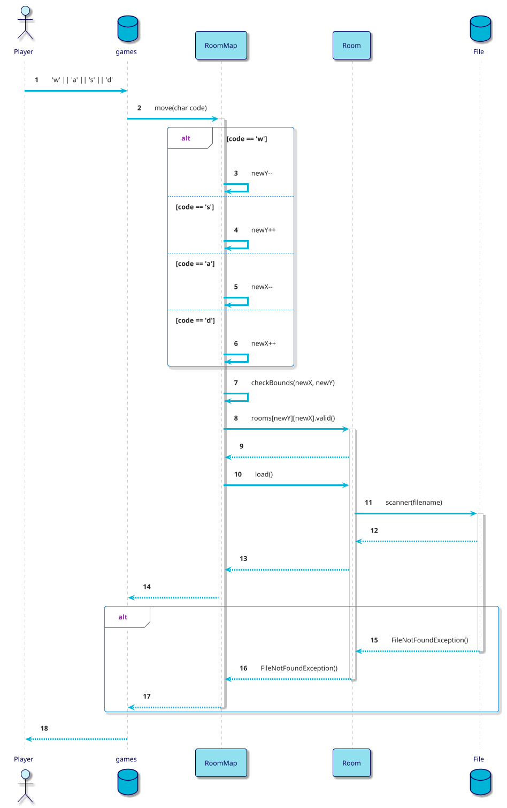
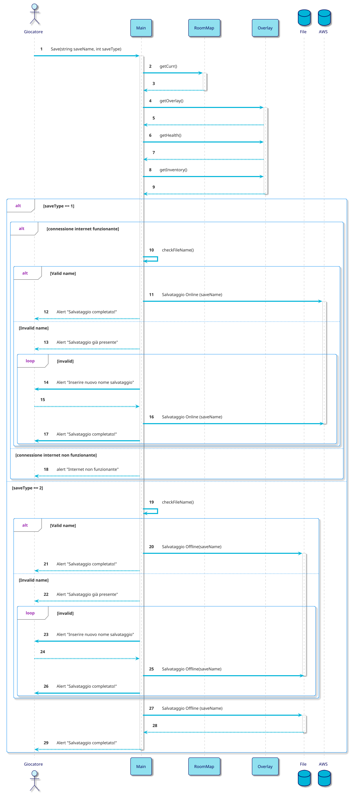
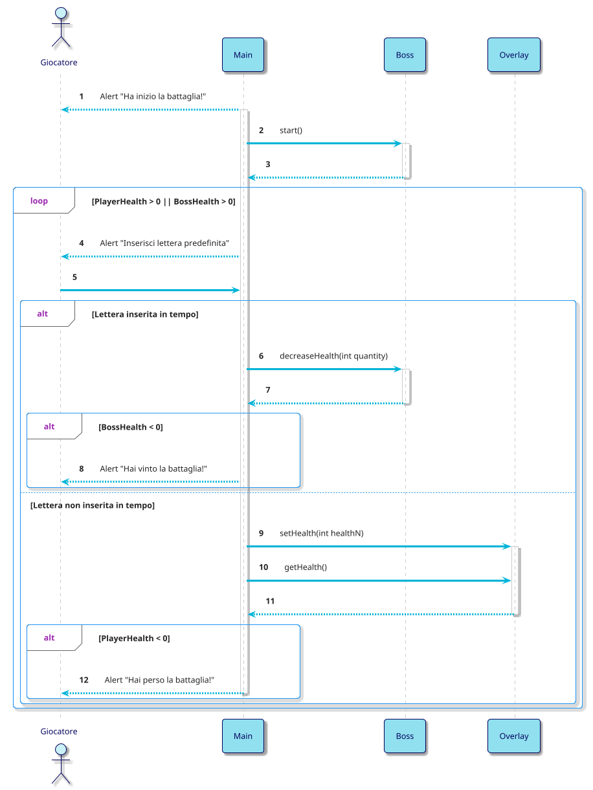

# System Sequence Diagrams

```plantuml
@startuml
!theme materia-outline
autonumber 

skinparam ArrowColor #00B4D8
skinparam ActorBorderColor #03045E
skinparam ActorFontColor #03045E
skinparam ActorBackgroundColor #CAF0F8
skinparam ParticipantFontColor #03045E
skinparam ParticipantBorderColor #03045E
skinparam ParticipantBackgroundColor #90E0EF
skinparam DatabaseBorderColor #03045E
skinparam DatabaseBackgroundColor #00B4D8
skinparam DatabaseFontColor #03045E
skinparam BackgroundColor #FFFFFF

title Game

actor player
database games
participant map

== Main Menu ==
player->games: createGame
games->map: load
== Game ==
loop alive?
opt
player->games: save
games-->player: done
end
create entity enemy
map->enemy: spawn
loop Both alive
player->enemy: attack
enemy-->player: defend
end
alt Enemy Defeated
player->enemy: loot
create participant item
enemy->item: drop
player->item: collect
else
player->games: quit
end
end
player->games: quit
@enduml

```

# Internal Sequence Diagrams

## move(char code)

```plantuml
@startuml
!theme materia-outline
autonumber
skinparam ArrowColor #00B4D8
skinparam ActorBorderColor #03045E
skinparam ActorFontColor #03045E
skinparam ActorBackgroundColor #CAF0F8
skinparam ParticipantFontColor #03045E
skinparam ParticipantBorderColor #03045E
skinparam ParticipantBackgroundColor #90E0EF
skinparam DatabaseBorderColor #03045E
skinparam DatabaseBackgroundColor #00B4D8
skinparam DatabaseFontColor #03045E
skinparam BackgroundColor #FFFFFF

actor Player
database games
participant RoomMap
participant Room
database File


Player -> games : 'w' || 'a' || 's' || 'd'
games -> RoomMap : move(char code)
activate RoomMap


alt code == 'w'
RoomMap -> RoomMap : newY--

else code == 's'
RoomMap -> RoomMap : newY++

else code == 'a'
RoomMap -> RoomMap : newX--

else code == 'd'
RoomMap -> RoomMap : newX++

end

RoomMap -> RoomMap : checkBounds(newX, newY)
RoomMap -> Room : rooms[newY][newX].valid()
activate Room
Room --> RoomMap : 
RoomMap -> Room : load()

Room -> File : scanner(filename)
activate File
File --> Room
Room --> RoomMap
RoomMap --> games
alt 
File --> Room : FileNotFoundException()
deactivate File
Room --> RoomMap : FileNotFoundException()
deactivate Room
RoomMap --> games
deactivate RoomMap
end

games --> Player
deactivate Room
deactivate RoomMap

@enduml


```

## Save(string saveName, int saveType)

```plantuml
@startuml
!theme materia-outline
autonumber
skinparam ArrowColor #00B4D8
skinparam ActorBorderColor #03045E
skinparam ActorFontColor #03045E
skinparam ActorBackgroundColor #CAF0F8
skinparam ParticipantFontColor #03045E
skinparam ParticipantBorderColor #03045E
skinparam ParticipantBackgroundColor #90E0EF
skinparam DatabaseBorderColor #03045E
skinparam DatabaseBackgroundColor #00B4D8
skinparam DatabaseFontColor #03045E
skinparam BackgroundColor #FFFFFF

actor Giocatore
participant Main
participant RoomMap
participant Overlay
database File
database AWS

Giocatore -> Main : Save(string saveName, int saveType)

activate Main

Main -> RoomMap : getCurr()
activate RoomMap
RoomMap --> Main :
deactivate RoomMap


Main -> Overlay : getOverlay()
activate Overlay
Overlay --> Main :

Main -> Overlay : getHealth()
Overlay --> Main :

Main -> Overlay : getInventory()
Overlay --> Main :

deactivate Overlay

alt saveType == 1

alt connessione internet funzionante

Main -> Main : checkFileName()

alt Valid name

Main -> AWS : Salvataggio Online (saveName)
activate AWS
Main --> Giocatore : Alert "Salvataggio completato!"

else Invalid name
Main --> Giocatore : Alert "Salvataggio già presente"

loop invalid
Main -> Giocatore : Alert "Inserire nuovo nome salvataggio"
Giocatore --> Main
Main -> AWS : Salvataggio Online (saveName)
deactivate AWS

Main -> Giocatore : Alert "Salvataggio completato!"

end
end


else connessione internet non funzionante

Main --> Giocatore : alert "Internet non funzionante"

end

else saveType == 2
Main -> Main : checkFileName()

alt Valid name

Main -> File : Salvataggio Offline(saveName)
activate File
Main --> Giocatore : Alert "Salvataggio completato!"

else Invalid name
Main --> Giocatore : Alert "Salvataggio già presente"

loop invalid
Main -> Giocatore : Alert "Inserire nuovo nome salvataggio"
Giocatore --> Main
Main -> File : Salvataggio Offline(saveName)
deactivate File

Main -> Giocatore : Alert "Salvataggio completato!"

end
end
Main -> File : Salvataggio Offline (saveName)
activate File
File --> Main
deactivate File
Main --> Giocatore : Alert "Salvataggio completato!"

deactivate Main
end

@enduml
```

## Battaglia

```plantuml
@startuml
!theme materia-outline
autonumber
skinparam ArrowColor #00B4D8
skinparam ActorBorderColor #03045E
skinparam ActorFontColor #03045E
skinparam ActorBackgroundColor #CAF0F8
skinparam ParticipantFontColor #03045E
skinparam ParticipantBorderColor #03045E
skinparam ParticipantBackgroundColor #90E0EF
skinparam DatabaseBorderColor #03045E
skinparam DatabaseBackgroundColor #00B4D8
skinparam DatabaseFontColor #03045E
skinparam BackgroundColor #FFFFFF

actor Giocatore
participant Main
participant Boss
participant Overlay

Main --> Giocatore : Alert "Ha inizio la battaglia!"
activate Main
Main -> Boss : start()
activate Boss
Boss --> Main
deactivate Boss
loop PlayerHealth > 0 || BossHealth > 0
Main --> Giocatore : Alert "Inserisci lettera predefinita"
Giocatore -> Main

alt Lettera inserita in tempo
Main -> Boss : decreaseHealth(int quantity)
activate Boss
Boss --> Main
deactivate Boss

alt BossHealth < 0

Main --> Giocatore : Alert "Hai vinto la battaglia!"

end

else Lettera non inserita in tempo
Main -> Overlay : setHealth(int healthN)
activate Overlay
Main -> Overlay : getHealth()
Overlay --> Main
deactivate Overlay

alt PlayerHealth < 0

Main --> Giocatore : Alert "Hai perso la battaglia!"

deactivate Main
end

end

end


@enduml

```
