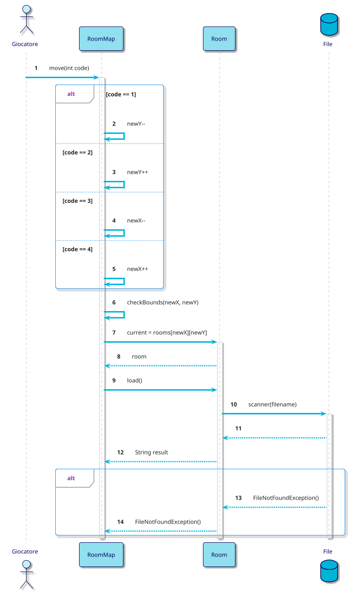

# Internal Sequence Diagrams

## move(int code)

```plantuml
@startuml
!theme materia-outline
autonumber
skinparam ArrowColor #00B4D8
skinparam ActorBorderColor #03045E
skinparam ActorFontColor #03045E
skinparam ActorBackgroundColor #CAF0F8
skinparam ParticipantFontColor #03045E
skinparam ParticipantBorderColor #03045E
skinparam ParticipantBackgroundColor #90E0EF
skinparam DatabaseBorderColor #03045E
skinparam DatabaseBackgroundColor #00B4D8
skinparam DatabaseFontColor #03045E
skinparam BackgroundColor #FFFFFF

actor Giocatore
participant RoomMap
participant Room
database File


Giocatore -> RoomMap : move(int code)
activate RoomMap


alt code == 1
RoomMap -> RoomMap : newY--

else code == 2
RoomMap -> RoomMap : newY++

else code == 3
RoomMap -> RoomMap : newX--

else code == 4
RoomMap -> RoomMap : newX++

end

RoomMap -> RoomMap : checkBounds(newX, newY)
RoomMap -> Room : current = rooms[newX][newY]
activate Room
Room --> RoomMap : room
RoomMap -> Room : load()

Room -> File : scanner(filename)
activate File
File --> Room
Room --> RoomMap : String result
alt 
File --> Room : FileNotFoundException()
Room --> RoomMap : FileNotFoundException()
end
deactivate File
deactivate Room
deactivate RoomMap

@enduml

```
