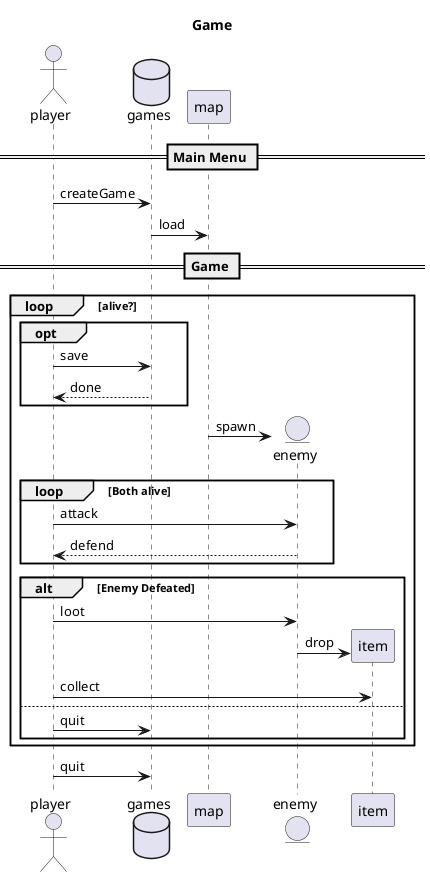

# System sequence diagram

```plantuml
@startuml

title Game

actor player
database games
participant map

== Main Menu ==
player->games: createGame
games->map: load

== Game ==
loop alive?
opt
player->games: save
games-->player: done
end
create entity enemy
map->enemy: spawn
loop Both alive
player->enemy: attack
enemy-->player: defend
end
alt Enemy Defeated
player->enemy: loot
create participant item
enemy->item: drop
player->item: collect
else
player->games: quit
end
end
player->games: quit

@enduml
```
